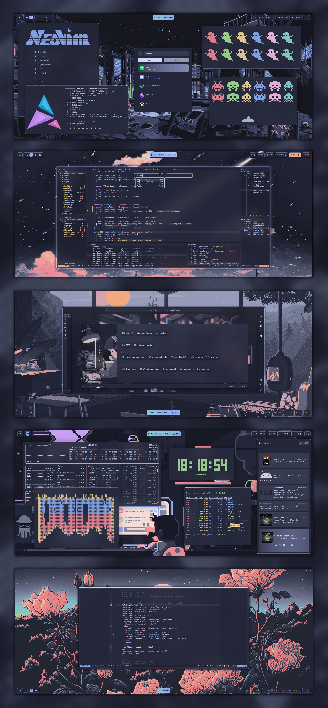

 

 

> [!NOTE]
> All the information about the Dotfiles is on the documentation website: https://dotfiles-docs.vercel.app/

> [!IMPORTANT]
> This repo follows the structure and naming of GNU Stow so use that if you want to use anything from here

> [!CAUTION]
> This is very personalized so some things may not work for you

## Credits

Just my personal configs based on this amazing dotfiles repo: https://github.com/Matt-FTW/dotfiles

(<a href="#readme-top">back to top</a>)

